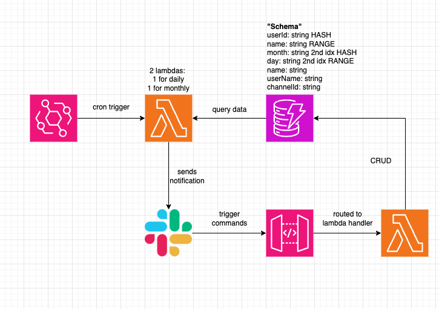

# Slack Brithday Reminder Bot

# Why I created this

I was using TimeTree to track my friends' birthdays, but the app kept letting me down. Notifications arrived late or didn't come at all, and the constant ads were becoming unbearable. After missing another friend's birthday because of a failed reminder, I decided it was time to build my own solution.

This project became an opportunity to kill two birds with one stone: solve my birthday tracking problem while diving into technologies I'd been wanting to explore. I'd been looking for an excuse to learn how to develop a Slack bot and wanted to experiment with serverless framework and architecture, so building a custom birthday reminder system seemed like the ideal way to get hands-on experience with both.

Note: I know there are a couple of unnecessary comments in the code base, they are there to remind me of what the syntax is doing exactly!

# Architecture

[Link to edit](https://app.diagrams.net/#G1UXOuEishYcbdyUDMsKSUEiCA3ukWdwVl%23%7B%22pageId%22%3A%22okO-tkjk7Xb_Cq-q0_zo%22%7D)

# Functional Requirements

## Slack commands

- /add
- /list-all
- /list-month
- /remove-bday

## Cron jobs

- cron job to trigger 8am everyday for brithday reminders
- cron job to trigger 7.59am every first day of the month for monthly birthday reminders

# How to run

## App

- `npm run deploy` - to deploy code on local to dev env
  - by default the env is dev, if you want to change to prod for example use `npm run deploy --stage prod`

## For infrastructure

- `npx serverless package` - to test locally, compiles and bundles app into `.esbuild/.serverless/` for inspection and also compiles the code to `.esbuild/.build`. Everytime code change, need to rerun this command.
- `npx serverless deploy` - to deploy the aws resources
- `npx serverless invoke local --function slackCommand --data '{"body": {"command": "/list", "userId": "123"}}'` - test function locally without deploying. If you are testing locally, need to remember to run `npx serverless package` command
- `npx serverless invoke --function slackCommand` - test remotely after deployment
- `npx serverless remove` - remove all deployed resources from AWS

# Deployment with Github Actions

- The code will automatically deploy when a PR is merged to main or any pushes to main. Deployment will not be run on PRs.
- The `security.yml` and `lint-and-format.yml` will run first. If they pass then `aggregator.yml` will run to trigger `deploy.yml` which will deploy to our aws dev env.

# Things to potentially work on

- Completed TODOs and enhancements
- use github actions for CICD
- Look into improving the efficiency of the code
- Create dev and prod versions of aws resource (won't do for now as might cost us money to have 2 envs running)
- DynamoDB stores a lot of duplicate data, can consider normalizing it

# Areas of Growth

## Serverless framework

- `serverless.yml` file is used by the Serverless Framework, a popular open-source tool to simplify deploying and managing serverless applications (mainly on AWS). It acts as your infrastructure-as-code (IaC) config, describing everything your app needs: functions, events, permissions, resources, etc.
- Key sections in a `serverless.yml` file
  - `service`: your project name
  - `provider`: aws runtime, region, etc
  - `functions`: defines lambda and its trigger
  - `resource`: raw CloudFormation for other AWS resources (non-lambda infra).
- How serverless works:
  - When you run `serverless deploy`, it turns your `serverless.yml` into an AWS CloudFormation stack.
  - Every resource in your resources: block gets created in that stack.
  - When you remove something from `serverless.yml` and redeploy, CloudFormation:
    - Compares the new template with the old one.
    - Deletes resources that are managed by that stack.
    - BUT if that resource is not actually managed by the stack anymore, it won’t be touched.
- In serverless.yml dynamodb configuration
  - `KeySchema` defines how the table is indexed, need hash (partition) key and optionally range (sort) key
  - `AttributeDefinitions` defines the data types of the keys used in the `KeySchema` and only those keys. Additional attributes can be stored in your items, but don't include them in key schema

### What serverless does behind the scenes for you

- In serverless.yml lambda/function configuration, if you specify `events: -http:` it will automatically create an API Gateway endpoint that triggers this function
- By default, the Serverless Framework creates ONE SINGLE IAM Role for ALL the functions defined within your serverless.yml file. Instead of you having to manually create the IAM Role and IAM Policy in CloudFormation syntax
- CloudFormation Stack Generation: Converts your YAML into a valid CloudFormation template. Handles dependency ordering (e.g., S3 bucket before Lambda that uses it). Manages resource naming with unique suffixes to avoid clashes.
- Lambda Packaging & Deployment. Zips your function code (plus node_modules or other deps). Uploads to a deployment bucket in S3 (auto-created if not present). Updates Lambda versions automatically, so you don’t overwrite existing ones without versioning.
- Log Group Creation: Creates a CloudWatch Logs group per Lambda function. Sets default retention (can be overridden with logRetentionInDays).

## Typescript

- Airbnb ESLint discourages for loops in favour of functional array methods beacuse:
  - bundle size of for loops requires polyfills in older environments
  - prefer functional programming, use methods like `.forEach(), .map(), .reduce()`

- Use `Object.entries(record)` to iterate over key-value pairs eg type of `Record<string, string>`

- async & await:
  - `await` can only be used in a function that is `async` (with the exception of top-level await in modern modules)
  - `await` blocks the execution of the async function. It does not block the entire program or the JavaScript thread. It only pauses the code within that specific async function.
  - `await` resolves or rejects (in event of error) the promise, ie returns the value
  - `async` forces a function to return a promise, no matter what, even if `await` is not used in the function body
  - When NOT in an async function: You must use `.then()` because `await` is not available. You get the promise object and attach callbacks to it.

- Declaring constants outside a class or method makes it a module-scoped constant. It is initialized only once when the file is first loaded, and it is available to everything else in that file.
  - Declaring it inside a method would mean it gets re-created every single time that method is called.
  - Declaring it outside a method means constants outside will only be created once per app/container lifetime
  - So for constants which will never change, placing it outside the class is the correct and standard practice

- Zod: a typescript validation library for run-time
  - `return result.Items as Birthday[]` is a type assertion, not a validation. We are telling typescript to trust us that theis data will match `Birthday` type.
  - This trust can be broken by malformed DynamoDB table

## Github Actions

- The node-version: '20' in the workflow is only for the CI/CD container. It's what version of Node.js gets installed in the GitHub Actions runner to execute your build commands
- `npm ci` vs `npm i`
  - npm ci is designed specifically for CI/CD environments and is better than npm install because:
    - Installs directly from package-lock.json (faster, more reliable)
    - Fails if package.json and package-lock.json are out of sync
    - Automatically removes node_modules before installing (clean slate)
    - Skips certain user-oriented features
    - Generally 2x faster in CI environments

## Misc

- `npm install` doesn't automatically remove unused packages, it only installs packages listed in `package.json`. Use `npm prune` to remove packages from `node_modules` directory that are not listed in the `package.json`.

- Random unfounded heuristic: if you find yourself copy and pasting code a lot, its a sign that you should be using a function instead!

- There is versions in for aws lambdas, we should delete older versions not in use to avoid hitting the 75-version limit per function and save costs.
